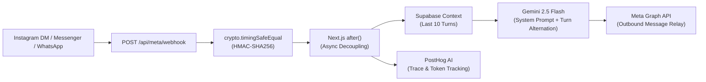

# Infriva Solutions — Vanguard Digital Architecture & Business Systems

[](https://nextjs.org/)
[](https://react.dev/)
[](https://tailwindcss.com/)
[](https://supabase.com/)
[](https://ai.google.dev/)
[](https://www.typescriptlang.org/)
[](#)

> **Infriva Solutions** is a luxury digital systems, CRM engineering, and performance marketing agency platform. Engineered with a **"Brutalist-Luxury"** and **"Swiss Digital"** aesthetic, the platform combines strict mathematical layouts (8-point grids, golden-ratio splits), physical spring motion dynamics, sub-50ms static edge delivery, and an automated omnichannel AI acquisition pipeline.

---

## Table of Contents

- [Architectural Highlights](#architectural-highlights)
- [Tech Stack Overview](#tech-stack-overview)
- [Core Capabilities & Routes](#core-capabilities--routes)
- [Omnichannel AI & Webhooks](#omnichannel-ai--webhooks)
- [Database Architecture](#database-architecture)
- [Security & DevSecOps Posture](#security--devsecops-posture)
- [Getting Started](#getting-started)
- [Environment Configuration](#environment-configuration)
- [Production Compilation](#production-compilation)
- [Deep Technical Documentation](#deep-technical-documentation)

---

## Architectural Highlights

- **Brutalist-Luxury Design System:** Unpolluted dual-tone palette consisting strictly of **Champagne Beige** (`#FBF8F3`), **Obsidian / Jet Black** (`#0A0A0B`), and **Pearl Ivory** (`#FFFFF0`).
- **Mathematical Layout Foundation:** 8-point base grids, concentric double-bezel card geometry, and golden-ratio column splits ($1:1.618 \approx 38.2\% / 61.8\%$).
- **Turbopack Static Site Generation (SSG):** All 26 marketing, portfolio, blog, and service pages are pre-rendered into static HTML at build time for sub-50ms TTFB.
- **Omnichannel Conversational AI:** Serverless Meta Graph API webhook routing for Instagram Direct, Messenger, and WhatsApp powered by **Google Gemini 2.5 Flash** with multi-turn Supabase conversational memory.
- **WCAG 2.1 AA Accessibility:** 44×44px minimum touch targets, accessible focus indicators, screen-reader word-spacing preservation, and keyboard skip-to-content links.
- **OWASP Top 10 Hardening:** Cryptographic HMAC-SHA256 signature verification, honeypot bot traps, sliding-window IP rate limiting, and parameterized SQL queries.

---

## Tech Stack Overview

| Layer | Technology | Version | Purpose |
| :--- | :--- | :--- | :--- |
| **Meta-Framework** | **Next.js (App Router)** | `16.3.5` | Turbopack compilation, hybrid SSG/SSR, and serverless route handlers. |
| **UI Library** | **React** | `19.2.8` | Concurrent rendering, modern server actions, and transition hooks. |
| **Styling Engine** | **Tailwind CSS v4** | `^4.0.0` | CSS-first configuration via `@theme` and `@utility` rules in `globals.css`. |
| **Motion Physics** | **Motion (Framer Motion)** | `13.4.0` | Hardware-accelerated transforms, spring physics, and scroll parallax. |
| **Database** | **Supabase (PostgreSQL)** | `2.117.2` | Persistent lead capture (`leads`) and conversational turns (`chat_messages`). |
| **AI Intelligence** | **Google Gemini API** | `gemini-2.5-flash` | Multi-turn conversational qualification and lead capture. |
| **Transactional Email** | **Resend** | `6.29.0` | Parallel notification dispatches to internal sales and prospective clients. |
| **Iconography** | **Phosphor Icons** | `2.1.10` | High-precision light vector SVG iconography. |
| **LLM Observability** | **PostHog Node** | `5.53.0` | AI generation tracing, token metrics, and latency profiling. |

---

## Core Capabilities & Routes

The application compiles 29 production routes across 5 distinct domains:

### 1. Flagship Agency Services (`/services/[slug]`)
Statically pre-rendered via `generateStaticParams` with dynamic metadata:
1. **Web Dev & UI/UX Design** (`/services/web-development`) — High-performance React/Next.js platforms.
2. **Custom CRM Systems** (`/services/crm-systems`) — Bespoke sales tracking and automation architectures.
3. **Full-Stack SEO & GEO** (`/services/seo-and-geo`) — Technical search and AI Generative Engine Optimization.
4. **Paid Advertising Management** (`/services/paid-advertising`) — Algorithmic Meta & Google Ads engines.
5. **Premium Content Creation** (`/services/premium-content`) — Authority storytelling and video distribution.
6. **Social Media Management** (`/services/social-media-management`) — Multi-platform brand authority.
7. **Retention Marketing** (`/services/retention-marketing`) — WhatsApp direct conversion ecosystems.

### 2. Engineering Insights & Thought Leadership (`/blog/[slug]`)
Editorial articles featuring rich-text `.prose` typography:
- *Why Your Social Media Gets Attention But Not Customers*
- *Why Every Small Business Needs CRM Software*
- *Why Your Website Is Not Getting Leads (And How to Fix It)*
- *SEO vs Google Ads: Which is Better For Your Business?*

### 3. Portfolio Case Studies (`/projects/[slug]`)
Interactive case studies with scroll-driven parallax imagery:
- **FlyingLyte** (`/projects/flyinglyte`) — High-performance travel booking engine.
- **StarX Hotel** (`/projects/starx`) — Direct reservation architecture eliminating OTA commissions.

### 4. Golden-Ratio Lead Capture (`/contact`)
- Asymmetric 1:1.618 layout split ($38.2\%$ trust indicators / $61.8\%$ contact form).
- Hidden honeypot trap (`_hp_website`) to neutralize automated spambots.
- In-memory sliding-window rate limiter (5 submissions/minute/IP).
- Dual-dispatch pipeline: writes raw UTF-8 records to Supabase `leads` table and triggers formatted HTML email alerts via Resend in parallel.

### 5. Adaptive Contrast Navigation & Legal Boundaries
- Real-time dark-detection navbar via `IntersectionObserver` that dynamically flips text colors between `#0A0A0B` and `#FFFFFF`.
- Custom branded 404 (`src/app/not-found.tsx`) and 500 (`src/app/error.tsx`) error boundaries.
- Search engine endpoints: dynamic XML sitemap (`/sitemap.xml`) and crawler directives (`/robots.txt`).

---

## Omnichannel AI & Webhooks



Incoming webhooks from Meta platforms are validated using cryptographic HMAC-SHA256 signatures (`X-Hub-Signature-256`) and immediately acknowledged with HTTP 200. Background conversational processing is decoupled using Next.js `after()`, querying historical context from Supabase, querying Gemini 2.5 Flash, and relaying replies back to the user via Meta Graph API v18.0.

---

## Database Architecture

The backend database is hosted on **Supabase PostgreSQL**:

- **`leads` Table:** Captures full name, company, email, phone, requested service, budget range, and project details. Indexed on `created_at DESC`, `email`, and `service`.
- **`chat_messages` Table:** Maintains conversational state across channels (`platform`: messenger, instagram, whatsapp). Indexed on `(sender_id, created_at DESC)` for instantaneous multi-turn context retrieval.
- **Row Level Security (RLS):** All tables enforce strict RLS policies, restricting data access to authorized service role keys.

---

## Security & DevSecOps Posture

- **XSS Sanitization:** User inputs are stored raw in the database but strictly HTML-escaped via `escapeHtml` during template string interpolation in transactional emails.
- **Spam & Flooding Protection:** In-memory sliding window rate limiters protect `/api/contact` and `/api/chat`. The contact form includes an invisible honeypot trap.
- **OWASP Response Headers:** Configured in `next.config.ts`:
  - `X-Frame-Options: DENY`
  - `X-Content-Type-Options: nosniff`
  - `Referrer-Policy: strict-origin-when-cross-origin`
  - `Strict-Transport-Security: max-age=31536000; includeSubDomains`

---

## Getting Started

### Prerequisites
- **Node.js**: `v20.0.0` or higher
- **npm**: `v10.0.0` or higher

### Installation

```bash
# 1. Clone the repository
git clone https://github.com/Arpan-Tyagi/infriva-solutions.git
cd infriva-solutions

# 2. Install dependencies
npm install

# 3. Configure environment variables
cp .env.example .env.local

# 4. Start local Turbopack development server
npm run dev
```

Open [http://localhost:3000](http://localhost:3000) in your browser to inspect the application.

### Webhook Development & Tunneling
To test incoming Meta webhooks locally:
```bash
npm run tunnel
```
This generates a public forwarding URL to configure in your Meta App Dashboard (`/api/meta/webhook`).

---

## Environment Configuration

See [`.env.example`](./.env.example) for the complete list of required environment variables. Key variables include:

```bash
# Supabase PostgreSQL
NEXT_PUBLIC_SUPABASE_URL="https://your-project.supabase.co"
NEXT_PUBLIC_SUPABASE_ANON_KEY="your-anon-key"
SUPABASE_SERVICE_ROLE_KEY="your-service-role-key"

# Google Gemini API
GEMINI_API_KEY="your-gemini-key"

# Resend Transactional Email
RESEND_API_KEY="re_your_api_key"
RESEND_FROM_EMAIL="Infriva Solutions <onboarding@resend.dev>"

# Meta for Developers
META_APP_ID="your-app-id"
META_APP_SECRET="your-app-secret"
META_ACCESS_TOKEN="your-access-token"
META_WEBHOOK_VERIFY_TOKEN="your-verify-token"

# PostHog Telemetry (Optional)
POSTHOG_API_KEY="your-posthog-key"
POSTHOG_HOST="https://us.i.posthog.com"
```

---

## Production Compilation

To compile and verify the production build:

```bash
# Run ESLint validation
npm run lint

# Compile optimized static and serverless build
npm run build
```

Expected compilation output:
```text
✓ Compiled successfully in 3.5s
✓ Finished TypeScript in 7.9s
✓ Generating static pages using 15 workers (29/29)
Route (app)
├ ○ /
├ ○ /_not-found
├ ○ /about
├ ƒ /api/chat
├ ƒ /api/contact
├ ƒ /api/meta/webhook
├ ○ /blog
├ ● /blog/[slug] (4 paths)
├ ○ /contact
├ ○ /privacy
├ ○ /projects
├ ● /projects/[slug] (2 paths)
├ ○ /robots.txt
├ ○ /services
├ ● /services/[slug] (7 paths)
├ ○ /sitemap.xml
└ ○ /terms
```

---

## Deep Technical Documentation

For in-depth architectural sequence diagrams, database DDL schemas, comprehensive feature operational mechanics, and a technical justification comparing Next.js 16 to legacy alternatives, review:

📘 **[`ARCHITECTURE.md`](./ARCHITECTURE.md)**

---

## License

Proprietary © 2026 Infriva Solutions. All rights reserved.
